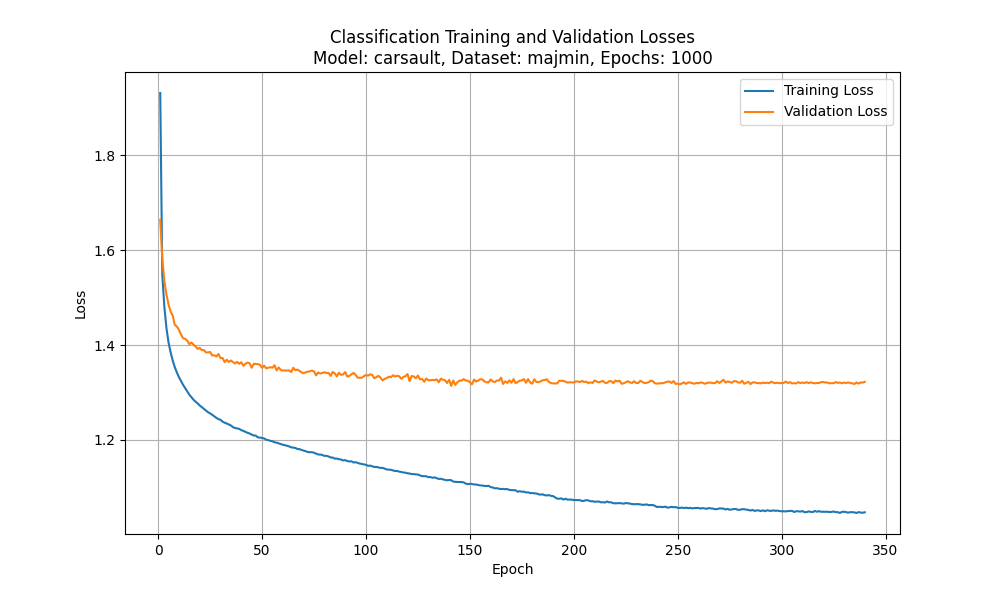

# ACE (Automated Chord Extraction)

## Instructions to Run
This code requires pytorch, pandas, scikit-learn, thop and torchinfo libraries. You will also need the **chordino features** and **MIREX labels** files from the [McGill Billboard Project](https://ddmal.music.mcgill.ca/research/The_McGill_Billboard_Project_(Chord_Analysis_Dataset)/) which consists of 890 songs.

Place the folders for both the features and labels in the `data` folder in the root project directory. The `process_data.py` file will process the data into a `full_data.pkl` file containing all of the data needed for training; the `clean_data.py` file can be ran afterwards to create the `test_dataloader.pkl`, `train_dataloader.pkl` and `val_dataloader.pkl`.

Note that running `process_data.py` takes a long time; however, `clean_data.py` is much shorter and easier to modify once you have processed the data.

## Instructions to Add New Model
Models are stored in the `model_architecture` folder under `architectures`. To add a new model:
1. The architecture should be definined similarly to `carsault.py` (or `semi_supervised.py` if using semi-supervised techniques).
2. The model should be imported into `main.py` (see line 16 for an example).
3. The model should be included in the list of models in the `main.py` arguments (line 25). 
3. The model should be included in the `if` statement in `main.py` that allocates models (see line 99 for example).
3. The model (along with whether it requires pretraining or not) should be defined in `run_models.py` in the `model_types` dict on line 12.

## Idea behind the design
The [Caursault et al](10.3390/electronics10212634) paper, [Chordify app](https://chordify.net/) and a personal desire for the tool along with an interest in convolutional neural networks and signal processing.

The idea is to use short-time fourier transforms (STFT) to process the data, creating a visual representation of pitch intensities over time; hypothetically, there is a correlation between these intensities and all possibly correct chord labels. Convolution has been shown effective at [image classification](https://papers.nips.cc/paper_files/paper/2012/hash/c399862d3b9d6b76c8436e924a68c45b-Abstract.html) and [filtering](https://proceedings.neurips.cc/paper/2020/file/2fd5d41ec6cfab47e32164d5624269b1-Paper.pdf) tasks, making it an ideal layer choice for extracting features from the STFT medium.

## Ideas to incorporate
- Self-supervised learning
    - Create a base model that learns how to organize chopped up data (try vertical and horizontal chopping).
    - Create a base model that learns how to recognize chord transitions.
- Transfer/reinforcement learning
    - Start with larger context size and use that model to train smaller context size models in addition to labled data valdiation
- Data augmentation
    - Transpose the songs (this is difficult because the data is already processed in the [McGill Billboard Project](https://ddmal.music.mcgill.ca/research/The_McGill_Billboard_Project_(Chord_Analysis_Dataset)/)).
- LSTM layer for learning based on context
    - Need to find out how to solve the length issue (songs are variable length)
- NGram Learning

## Tests and results
The [McGill Billboard Project](https://ddmal.music.mcgill.ca/research/The_McGill_Billboard_Project_(Chord_Analysis_Dataset)/) has 4 sets of labels it provides, these are the Major/Minor dataset, Major/Minor/Sevenths dataset, Major/Minor/Inversions dataset and the Major/Minor/Sevenths/Inversions dataset; these datasets have 28, 54, 73 and 157 labels respectively, including an X label to represent no chord values (these are stored as `None`, `"N"` and `"X"` in the original dataset and simplified to just `"X"` in the `clean_data.py` file). It should be noted that by default this does not cover every single chord label (only including flat labels, and not including every possible modification), and for some labels there are 2 or less examples in the largest label set. For our purposes we will refer to the datasets as M1, M2, M3 and M4 respectively, working from a the base model provided by Carsault [(a different paper)](https://doi.org/10.48550/arXiv.1911.04973).

*Note that for initial tests each model is only run for 10 epochs, as such the models may not have fully trained.
### Model Comparison Table

| Model                     | Number of Classes | Accuracy | F1 Score | GFLOPs | Parameters |
|---------------------------|-------------------|----------|----------|--------|------------|
| [Carsault](10.3390/electronics10212634) - Majmin         | 28                | 0.5022   | 0.4246   | 0.0019 | 263,122    |
| [Carsault](10.3390/electronics10212634) - Majmin7       | 54                | 0.5181   | 0.3207   | 0.0019 | 266,476    |
| [Carsault](10.3390/electronics10212634) - Majmininv     | 73                | 0.3894   | 0.1332   | 0.0019 | 268,927    |
| Small Dilation - Majmin   | 28                | 0.4785   | 0.4037   | 0.0065 | 1,009,618  |
| Small Dilation - Majmin7  | 54                | 0.5313   | 0.3415   | 0.0065 | 1,012,972  |
| Small Dilation - Majmininv| 73                | 0.3316   | 0.1205   | 0.0065 | 1,015,423  |
| Multi Dilation - Majmin   | 28                | 0.6535   | 0.5146   | 0.0022 | 999,502    |
| Multi Dilation - Majmin7  | 54                | 0.5328   | 0.3231   | 0.0022 | 1,002,856  |
| Multi Dilation - Majmininv| 73                | 0.4910   | 0.1702   | 0.0022 | 1,005,307  |
| Semi Supervised - Majmin  | 28                | 0.1191   | 0.0076   | 0.0019 | 263,122    |

### Loss Graphs

| Model                     | Loss Graph |
|---------------------------|------------|
| Carsault - Majmin         |  |
| Carsault - Majmin7       |  |
| Carsault - Majmininv     |  |
| Small Dilation - Majmin   |  |
| Small Dilation - Majmin7  |  |
| Small Dilation - Majmininv|  |
| Multi Dilation - Majmin   |  |
| Multi Dilation - Majmin7  |  |
| Multi Dilation - Majmininv|  |
| Semi Supervised - Majmin  |  |

## Immediate Goals
-  Find a train/test/val split based on literature
- CNN-LSTM from the [Caursault et al 2024](10.3390/electronics10212634) paper.
- Show 10 examples for each class randomly pulled from training and testing sets (and visualize how they were generated).
- Try using concurrent dilation layers with different rates (as opposed to a single rate and feeding dilation layers into each other). Can feed into your attention mechanism.
- Moving around the attention mechnism (early, mid and late attention).
- Create a program to transpose the data (working from the central 12 bins, moving up 6 semitones and down 6 semitones while adjusting labels accordingly).
    - Could also add logic to create copies of every piece of data along with all of their labels (i.e. E=Fb, so any instances of the label E could be copied with the label Fb and still be valid); however, this has other possible side effects, as future labels depend on previous labels when transcribing chords.

## References

[1]
S. Bhardwaj, S. M. Salim, D. T. A. Khan, and S. J. Masoudian, 'Automated Music Generation using Deep Learning', 2022, pp. 193–198.

[2]
J. Choi and K. Lee, 'Pop2Piano : Pop Audio-Based Piano Cover Generation', 2023, pp. 1–5.

[3]
Y. Wu, T. Carsault, and K. Yoshii, 'Automatic Chord Estimation Based on a Frame-wise Convolutional Recurrent Neural Network with Non-Aligned Annotations', 2019, pp. 1–5.

[4]
H. Yamaga, T. Momma, K. Kojima, and Y. Itoh, 'Ensemble of Transformer and Convolutional Recurrent Neural Network for Improving Discrimination Accuracy in Automatic Chord Recognition', 2023, pp. 2299–2305.

[5]
E. J. Humphrey and J. P. Bello, 'Rethinking Automatic Chord Recognition with Convolutional Neural Networks', 2012, vol. 2, pp. 357–362.

[6]
S. Maruo, K. Yoshii, K. Itoyama, M. Mauch, and M. Goto, 'A feedback framework for improved chord recognition based on NMF-based approximate note transcription', 2015, pp. 196–200.

[7]
G. Durán and P. de la Cuadra, 'Transcribing Lead Sheet-Like Chord Progressions of Jazz Recordings', Computer Music Journal, vol. 44, pp. 26–42, 2021.

[8]
K. Vaca, A. Gajjar, and X. Yang, 'Real-Time Automatic Music Transcription (AMT) with Zync FPGA', 2019, pp. 378–384.

[9]
K. Shibata et al., 'Joint Transcription of Lead, Bass, and Rhythm Guitars Based on a Factorial Hidden Semi-Markov Model', 2019, pp. 236–240.

[10]
H. Pedroza, W. Abreu, R. M. Corey, and I. R. Roman, 'Guitar-TECHS: An Electric Guitar Dataset Covering Techniques, Musical Excerpts, Chords and Scales Using a Diverse Array of Hardware', 2025, pp. 1–5.

[11]
J. Sun, H. Li, and L. Lei, 'Key detection through pitch class distribution model and ANN', 2009, pp. 1–6.

[12]
E. J. Humphrey and J. P. Bello, 'From music audio to chord tablature: Teaching deep convolutional networks toplay guitar', in 2014 IEEE International Conference on Acoustic, Speech and Signal Processing (ICASSP), 2014.

[13]
M. Bortolozzo, R. Schramm, and C. R. Jung, 'Improving the Classification of Rare Chords With Unlabeled Data', in ICASSP 2021 - 2021 IEEE International Conference on Acoustics, Speech and Signal Processing (ICASSP) |, 2021.

[14]
T. Carsault, J. Nika, P. Esling, and G. Assayag, 'Combining Real-Time Extraction and Prediction of Musical Chord Progressions for Creative Applications', 2021, vol. 10.

[15]
Y. Jadhav, A. Patel, R. H. Jhaveri, and R. Raut, 'Transfer Learning for Audio Waveform to Guitar Chord Spectrograms Using the Convolution Neural Network', Mobile Information Systems, vol. 2022, pp. 1–11, Aug. 2022.

[16]
Y.-S. Lee, Y.-L. Chiang, P.-R. Lin, C.-H. Lin, and T.-C. Tai, 'Robust and efficient content-based music retrieval system', APSIPA Transactions on Signal and Information Processing, vol. 5, no. 1, 2016.

[17]
N. Li, 'Generative Adversarial Network for Musical Notation Recognition during Music Teaching', Computational Intelligence and Neuroscience, vol. 2022, pp. 1–9, Jun. 2022.

[18]
H. Mukherjee et al., 'Music chord inversion shape identification with LSTM-RNN', Procedia Computer Science, vol. 167, pp. 607–615, 2020.

[19]
R. Nishikimi, E. Nakamura, M. Goto, and K. Yoshii, 'Audio-to-score singing transcription based on a CRNN-HSMM hybrid model', APSIPA Transactions on Signal and Information Processing, vol. 10, no. 1, 2021.

[20]
Y. Ojima, E. Nakamura, K. Itoyama, and K. Yoshii, 'Chord-aware automatic music transcription based on hierarchical Bayesian integration of acoustic and language models', APSIPA Transactions on Signal and Information Processing, vol. 7, no. 1, 2018.

[21]
J. Pauwels, J.-P. Martens, and M. Leman, 'The Influence of Chord Duration Modeling on Chord and Local Key Extraction', in 2011 10th International Conference on Machine Learning and Applications and Workshops, 2011, pp. 136–141.

[22]
A. Perez, H. L. Ma, S. Zawaduk, and M. R. W. Dawson, 'How Do Artificial Neural Networks Classify Musical Triads? A Case Study in Eluding Bonini's Paradox', Cognitive Science, vol. 47, no. 1, Jan. 2023.

[23]
J. de Berardinis, A. Meroño-Peñuela, A. Poltronieri, and V. Presutti, 'ChoCo: a Chord Corpus and a Data Transformation Workflow for Musical Harmony Knowledge Graphs', Scientific Data, vol. 10, no. 1, Sep. 2023.

[24]
I. Rida, R. Herault, and G. Gasso, 'Supervised Music Chord Recognition', in 2014 13th International Conference on Machine Learning and Applications, 2014, pp. 336–341.

[25]
S. Shi, S. Xi, and S.-B. Tsai, 'Research on Autoarrangement System of Accompaniment Chords Based on Hidden Markov Model with Machine Learning', Mathematical Problems in Engineering, vol. 2021, pp. 1–10, Oct. 2021.

[26]
W. Wang, 'Music chord sequence recognition method based on audio feature extraction algorithm', in 2023 IEEE International Conference on Control, Electronics and Computer Technology (ICCECT), 2023.

[27]
Y. Wu and K. Yoshii, 'Joint Chord and Key Estimation Based on a Hierarchical Variational Autoencoder with Multi-task Learning', APSIPA Transactions on Signal and Information Processing, vol. 11, no. 1, 2022.

[28]
Y. Yu, R. Zimmermann, Y. Wang, and V. Oria, 'Recognition and Summarization of Chord Progressions and Their Application to Music Information Retrieval', in 2012 IEEE International Symposium on Multimedia, 2012, pp. 9–16.

[29]
C. Zhuang, 'GCA:A chord music generation algorithm based on double-layer LSTM', in 2021 3rd International Conference on Advances in Computer Technology, Information Science and Communication (CTISC), 2021.

[30]
G. Brunner, Y. Wang, R. Wattenhofer, and J. Wiesendanger, 'JamBot: Music Theory Aware Chord Based Generation of Polyphonic Music with LSTMs', in 2017 IEEE 29th International Conference on Tools with Artificial Intelligence (ICTAI), 2017, pp. 519–526.

[31]
T. Gagnon, S. Larouche, and R. Lefebvre, 'A neural network approach for preclassification in musical chords recognition', 2003, vol. 2, pp. 2106-2109 Vol.2.

[32]
F. Korzeniowski, D. R. W. Sears, and G. Widmer, 'A Large-Scale Study of Language Models for Chord Prediction', CoRR, vol. abs/1804.01849, 2018.

[33]
Y. Wu, E. Nakamura, and K. Yoshii, 'A Variational Autoencoder for Joint Chord and Key Estimation from Audio Chromagrams', 2020, pp. 500–506.

[34]
V. Eremenko, E. Demirel, B. Bozkurt, and X. Serra, 'Audio-Aligned Jazz Harmony Dataset for Automatic Chord Transcription and Corpus-based Research', in Proceedings of the 19th International Society for Music Information Retrieval Conference, ISMIR 2018, Paris, France, September 23-27, 2018, 2018, pp. 483–490.

[35]
N. Orio, 'Music Retrieval: A Tutorial and Review', Found. Trends Inf. Retr., vol. 1, no. 1, pp. 1–90, 2006.

[36]
Z. Wang et al., 'POP909: A Pop-Song Dataset for Music Arrangement Generation', in Proceedings of the 21th International Society for Music Information Retrieval Conference, ISMIR 2020, Montreal, Canada, October 11-16, 2020, 2020, pp. 38–45.

[37]
L. Oudre, C. Fevotte, and Y. Grenier, 'Probabilistic Template-Based Chord Recognition', IEEE Transactions on Audio, Speech, and Language Processing, vol. 19, pp. 2249–2259, Nov. 2011.

[38]
G. R. M., K. S. Rao, and P. P. Das, 'Harmonic-Percussive Source Separation of Polyphonic Music by Suppressing Impulsive Noise Events', in 19th Annual Conference of the International Speech Communication Association, Interspeech 2018, Hyderabad, India, September 2-6, 2018, 2018, pp. 831–835.

[39]
J. Sleep, 'Automatic Music Transcription with Convolutional Neural Networks using Intuitive Filter Shapes', Robert E. Kennedy Library, Cal Poly, 2017.

[40]
J. C. Brown, 'Calculation of a constant Q spectral transform', The Journal of the Acoustical Society of America, vol. 89, no. 1, pp. 425–434, Jan. 1991.

[41]
Y. Wu, T. Carsault, E. Nakamura, and K. Yoshii, 'Semi-Supervised Neural Chord Estimation Based on a Variational Autoencoder With Latent Chord Labels and Features', IEEE/ACM Transactions on Audio, Speech, and Language Processing, vol. 28, pp. 2956–2966, 2020.

[42]
Y. Yu, R. Zimmermann, Y. Wang, and V. Oria, 'Scalable Content-Based Music Retrieval Using Chord Progression Histogram and Tree-Structure LSH', IEEE Transactions on Multimedia, vol. 15, pp. 1969–1981, Dec. 2013.

[43]
L. C. Reghunath and R. Rajan, 'Predominant audio source separation in polyphonic music', EURASIP Journal on Audio, Speech, and Music Processing, vol. 2023, no. 1, Nov. 2023.

[44]
E. Tverdokhleb, N. Myronova, and T. Fedoronchak, 'Music signal processing to obtain its chorded representation', 2017, pp. 301–304.

[45]
J.-Q. Deng and Y.-K. Kwok, 'LARGE VOCABULARY AUTOMATIC CHORD ESTIMATION WITH AN EVEN CHANCE TRAINING SCHEME', in Proceedings of the 18th International Society for Music Information Retrieval Conference, ISMIR 2017, Suzhou, China, October 23-27, 2017, 2017, pp. 531–536.

[46]
H. V. Koops, W. B. de Haas, J. Bransen, and A. Volk, 'Automatic chord label personalization through deep learning of shared harmonic interval profiles', Neural Comput. Appl., vol. 32, no. 4, pp. 929–939, 2020.

[47]
E. Row, J. Tang, and G. Fazekas, 'JAZZVAR: A Dataset of Variations found within Solo Piano Performances of Jazz Standards for Music Overpainting', CoRR, vol. abs/2307.09670, 2023.

[48]
G. Reis, N. Fonseca, and F. Ferndandez, 'Genetic Algorithm Approach to Polyphonic Music Transcription', 2007, pp. 1–6.

[49]
H. Papadopoulos and G. Peeters, 'Large-Scale Study of Chord Estimation Algorithms Based on Chroma Representation and HMM', in International Workshop on Content-Based Multimedia Indexing, CBMI '07, Bordeaux, France, June 25-27, 2007, 2007, pp. 53–60.

[50]
L. W. Kong and T. Lee, 'Chord classification of multi-instrumental music using exemplar-based sparse representation', 2013, pp. 113–117.

[51]
K. O'Hanlon, S. Ewert, J. Pauwels, and M. B. Sandler, 'Improved template based chord recognition using the CRP feature', in 2017 IEEE International Conference on Acoustics, Speech and Signal Processing, ICASSP 2017, New Orleans, LA, USA, March 5-9, 2017, 2017, pp. 306–310.

[52]
L. Oudre, Y. Grenier, and C. Fevotte, 'Chord Recognition by Fitting Rescaled Chroma Vectors to Chord Templates', IEEE Transactions on Audio, Speech, and Language Processing, vol. 19, pp. 2222–2233, 2011.

[53]
E. J. Humphrey, T. Cho, and J. P. Bello, 'Learning a robust Tonnetz-space transform for automatic chord recognition', 2024, pp. 453–456.

[54]
A. Uemura and J. Katto, 'Chord recognition using Doubly Nested Circle of Fifths', 2012, pp. 449–452.

[55]
F. Korzeniowski and G. Widmer, 'On the Futility of Learning Complex Frame-Level Language Models for Chord Recognition', in AES International Conference Semantic Audio 2017, Erlangen, Germany, June 22-24, 2017, 2017.

[56]
S. Liu, 'Music Tutor: Application of Chord Recognition in Music Teaching', in 2021 International Conference on Signal Processing and Machine Learning (CONF-SPML), 2021, pp. 154–157.

[57]
T. Hori, K. Nakamura, and S. Sagayama, 'Music chord recognition from audio data using bidirectional encoder-decoder LSTMs', in 2017 Asia-Pacific Signal and Information Processing Association Annual Summit and Conference, APSIPA ASC 2017, Kuala Lumpur, Malaysia, December 12-15, 2017, 2017, pp. 1312–1315.

[58]
H.-T. Cheng, Y.-H. Yang, Y.-C. Lin, I.-B. Liao, and H. H. Chen, 'Automatic chord recognition for music classification and retrieval', 2008, pp. 1505–1508.

[59]
P. Mabpa, T. Sapaklom, E. Mujjalinvimut, J. Kunthong, and P. N. N. Ayudhya, 'Automatic Chord Recognition Technique for a Music Visualizer Application', 2021, pp. 416–419.

[60]
F. Korzeniowski and G. Widnaer, 'Automatic Chord Recognition with Higher-Order Harmonic Language Modelling', 2018, pp. 1900–1904.

[61]
J. A. Burgoyne, J. Wild, and I. Fujinaga, 'An Expert Ground Truth Set for Audio Chord Recognition and Music Analysis', in Proceedings of the 12th International Society for Music Information Retrieval Conference, ISMIR 2011, Miami, Florida, USA, October 24-28, 2011, 2011, pp. 633–638.

[62]
M. Mauch and S. Dixon, 'Approximate Note Transcription for the Improved Identification of Difficult Chords', in Proceedings of the 11th International Society for Music Information Retrieval Conference, ISMIR 2010, Utrecht, Netherlands, August 9-13, 2010, 2010, pp. 135–140.

[63]
S. H. Nawab, S. A. Ayyash, and R. Wotiz, 'Identification of musical chords using CONSTANT-Q spectra', 2001, vol. 5, pp. 3373–3376 vol.5.